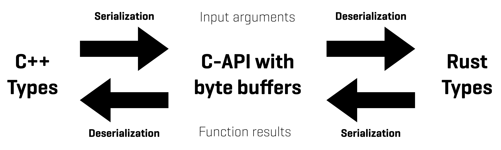

# BuFFI

BuFFI is a tool that allows users to generate a C++ FFI based on Rust functions or impl blocks that are annotated with it. It consists of a proc macro (called `exported`, part of `buffi_macro`) and a function `generate_bindings` to generate C/C++ code available via this crate. The proc macro needs to be attached to every function or impl block that contains your Rust API functionality and `generate_bindings` can be used as part of a tool, a build step, or a CI job to generate the C and C++ files. Note that you only need to add `buffi` to your project and the macro will be made available to you as well.

## Concept

The rough concept of this approach is to use byte buffers to handle all data input and output. This way we can minimize necessary boilerplate, keep code idiomatic (on the Rust and the C++ side) and avoid the need to write unsafe code. BuFFI also takes care of all manual pointer handling and memory deallocations, so you can focus on writing a pure Rust API that can be easily accessed from C++ code.



If you want to learn more about how BuFFI works, check out the video linked below in [Deep Dive](#deep-dive).

## Getting started

Before we begin, there is a minimal example in this repository that gives a great overview of what is needed to get started and the results that you can expect. There are a couple of bits that need to be added manually as well as some (naming) restrictions, but we hope to get rid of some of them in the future. Most importantly, your Rust API code itself won't have to adhere to any limitations (as long as you only pass serializable data and return a Result).

### Preparing your API

To get started, you will want to include the `buffi` crate in your API crate and annotate every function or impl block with a `buffi::exported`. The simplest approach would look like this:

```Rust
#[buffi::exported]
pub fn free_standing_function(input: i64) -> Result<i64, String> {
    Ok(input)
}
```

Please note that every function annotated with the macro needs to return a Result. The serialization/deserialization can theoretically lead to errors and it is better to catch them in the process. To unify the error handling in the code generated by the proc macro and on the C++ side, a `SerializableError` needs to be present in a module called `errors` (e.g. `your-api-crate/src/errors.rs`). For the basic functionality, it has to implement `From` for a couple of types, as shown here:

```Rust
// errors.rs
use serde::{Deserialize, Serialize};
use std::any::Any;

#[derive(Serialize, Deserialize)]
pub struct SerializableError {
    pub message: String,
}

// this is also the place where you could implement `From<YourFavoriteErrorType>`

// these implementations are strictly required
impl From<String> for SerializableError {
    fn from(value: String) -> Self {
        Self { message: value }
    }
}

impl From<Box<dyn Any + Send>> for SerializableError {
    fn from(value: Box<dyn Any + Send>) -> Self {
        let message = value
            .downcast_ref::<&'static str>()
            .map(|c| String::from(*c))
            .or_else(|| value.downcast_ref::<String>().cloned())
            .unwrap_or_default();
        Self { message }
    }
}

impl From<buffi::bincode::error::DecodeError> for SerializableError {
    fn from(value: buffi::bincode::error::DecodeError) -> Self {
        Self {
            message: format!("Bincode Decode Error: {value}"),
        }
    }
}

impl From<buffi::bincode::error::EncodeError> for SerializableError {
    fn from(value: buffi::bincode::error::EncodeError) -> Self {
        Self {
            message: format!("Bincode Encode Error: {value}"),
        }
    }
}

```

Note that the module, the error itself, and the fields on the error need to be public. If that is not the case, you should receive an error during code generation that points you to this issue. You will have to add [Serde](https://crates.io/crates/serde) to your crate for this to work. The right version of `bincode` will be provided by `buffi` and is re-exported as `buffi::bincode`.

Furthermore, to release any memory allocated by the Rust side of your API, you will have to include a function for the C++ side to release memory. This function looks like this:

```Rust
/// This function frees a byte buffer allocated on the Rust side
///
/// * `ptr`: The ptr to the buffer
/// * `size`: The size of the buffer
///
/// # Safety
///
/// Calling this function outside a destructor is highly unsafe
/// and result in a use-after-free
#[no_mangle]
pub unsafe extern "C" fn buffi_free_byte_buffer(ptr: *mut u8, size: usize) {
    if !ptr.is_null() {
        // SAFETY: We checked for null above
        let v = unsafe { Vec::from_raw_parts(ptr, size, size) };
        drop(v);
    }
}

```

Make sure to include it somewhere amongst your other API functions. If it is missing you will most likely receive a compiler error on the C++ side.

### Generating the C/C++ code

After your API is prepared, we can move on to generate the C and C++ code. Since the code generation is based on Rustdoc it is not possible to simply put it into a `build.rs` file (otherwise you will end up with an endless loop of Rust compilations). We recommend to have a separate target that handles code generation (again, this is shown in the minimal example in the repo). For example, running an `xtask` could be a great way to integrate it into your project if you use this system already.

Before we can generate some code, we need to setup a [`Config`](https://docs.rs/buffi/latest/buffi/struct.Config.html) object. In our example we read it from a toml file, but it can be created in code as well. It will include all necessary information that needs to be passed on to Rustdoc and the code generation. With such an object and an output path for the C/C++ files, we can simply call
```Rust
buffi::generate_bindings(include_dir.as_path(), config);
```
and all necessary files will be generated.

For Bincode and Serde:
* **binary.hpp** and **bincode.hpp** (for Bincode)
* **serde.hpp** (for Serde)

For your API:
* **api_functions.hpp** (C-API with byte buffers)
* **your_namespace.hpp** (includes all the types, is named after your namespace)
* **testclient.hpp** (C++ functions originating in a Rust "impl" block, here belonging to `TestClient`)
* **free_standing_functions.hpp** (C++ functions not from an „impl“ block)

To get started on the C++ side, you need to include only the latter two files.

## Considerations

BuFFI is still in its early stages and there are a couple of things to consider when you think about using this crate.

* **Applicability**: At GiGa infosystems we use BuFFI in our day-to-day work and have deployed this FFI in production, and so far, it works exceptionally well. This does not mean that every other use case is fully supported by this already. We make heavy use of `rustdoc-types` and resolving and mapping every type that will be part of an API is a tough job. We expect things to break eventually when other developers will attempt to integrate BuFFI in their projects. We strongly encourage everyone who could benefit from BuFFI to give it a go and open an issue if anything should break. Many issues can be resolved quickly.
* **Rust Toolchain and Stability**: As mentioned before, BuFFI makes use of Rustdoc's unstable JSON output and `rustdoc-types`. This means that, at the moment, we rely on `RUSTC_BOOTSTRAP` to access nightly functionality in stable compilers. Additionally, the JSON format and `rustdoc-types` are tightly connected to a released Rust toolchain. Whenever a new stable toolchain is released, there is a good chance the JSON format and `rustdoc-types` will have changed as well. This means that every version of BuFFI will be guaranteed to work with one version of the Rust toolchain (as indicated by the Rust Version in the BuFFI version). We have plans to adjust this in the future via [Trustfall](https://crates.io/crates/trustfall_rustdoc), but for now we will make sure BuFFI will always work with the latest **stable** Rust toolchain. If your crate follows this release cycle as well, you should be golden. If not, make sure to pick the right BuFFI version for you and fix the Rust toolchain in your `rust-toolchain` file.

## Deep dive

Check out this presentation from EuroRust where @SwishSwushPow talked about the inner workings of BuFFI.

[](https://www.youtube.com/watch?v=0q6OFUovDnQ)

You can also have a look at the slides [here](knowledge/RustLab2024.pdf). They are from a different presentation at RustLab and a bit more polished.

## License

* Apache License, Version 2.0 (https://www.apache.org/licenses/LICENSE-2.0).
* MIT License (https://opensource.org/licenses/MIT)
